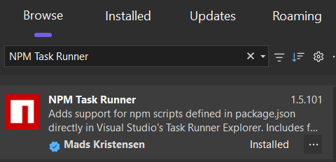
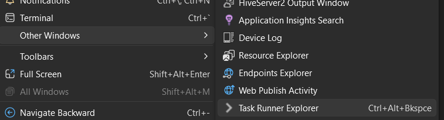
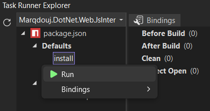

## How to Build Solution

### [<- Go Back](../README.md)

- Ensure you have [Node.js](https://nodejs.org/en/download) installed on your computer.
- Install the [NPM Task Runner](https://marketplace.visualstudio.com/items?itemName=MadsKristensen.NpmTaskRunner64) extension.
  - 
- Open the Task Runner Explorer window.
  - 
- Run the NPM install.
  - 
